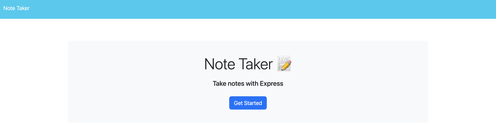
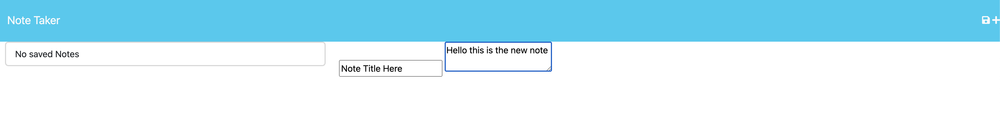

# Note Taker
  
  ## Table of Contents
  - [Project description](#description)
  - [Installation](#installation)
  - [Useage](#usage)
  - [Collaborators](#collaborators)
  - [How to Contribute](#contributing)
  - [Testing](#tests)
  - [License](#license)
  ## Description 
This is a note-taker application that can be used to write and save notes. The application uses an Express.js back end and will save and retrieve note data from a JSON file.

  ## Installation
  Use node i to install
  
  ## Usage 
Use either node server.js or npm start. Once the application is up and running, you can click "get started" on the home page and then enter in the note title and text. The save icon will then generate the notes on the left hand side. To detele a note, please use the trash bin icon.

  ## Collaborators 
  N/A 

  ## Testing 
  N/A 

  ## Questions?
  Please contact me at:
  GitHub: https://github.com/elawilliam
  Email: ela.witham@gmail.com
  
  ## License 
  Note Taker is licensed under the: 
  
  